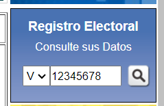
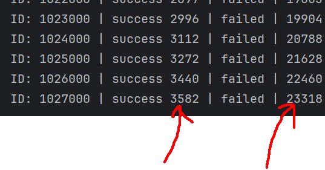

Permite consultar el registro de votantes del cne (http://www.cne.gob.ve/)


### Cliente HTTP

Puede usar el cliente http para consultar por una cédula indivitual

```go
package main

import "github.com/Eitol/cne_scraper/cne"
import "fmt"

func main() {
    cedula := 12345678
    client := cne.NewCNEClient()
	person, err := client.GetPersonByDocID(cedula)
	if err != nil {
		        fmt.Println(err)
	}
    fmt.Println(person)
}

```

Datos que se obtienen de la consulta:

- Cedula       int
- Nombre         string
- Estado        string
- Municipalidad string
- Parroquia       string


### Scraper

Tambien contiene un scraper que permite consultar por un rango de cédulas

Guarda el contenido en un fichero .gob (formato binario de golang)


Este es el input de donde se obtiene la data:




### Instalación

Necesitas tener golang 1.20 o superior instalado en tu máquina.


### Uso rápido

Para corre el scraper, ejecuta el siguiente comando:

```sh
$ go run main.go
```

Se ejecutará con las configuraciones por defecto

Cuando alguno de los valores llegan al tamaño del chunk size, se guardan en un archivo .gob




## PASO A PASO

### Instalación

Para utilizar este scraper, necesitas tener Go instalado en tu sistema. 

Sigue estos pasos para configurar y ejecutar el scraper:

1- Instalación de Go: Asegúrate de tener Go instalado en tu sistema. Puedes descargarlo desde la página oficial de Go.

2- Clonar el repositorio: Clona este repositorio en tu máquina local usando el siguiente comando en tu terminal:

```sh
git clone https://github.com/Eitol/cne_scraper.git
```

3- Instalar dependencias: Navega hasta el directorio del repositorio clonado e instala las dependencias necesarias con el comando go get:

```sh
cd cne_scraper
go mod tidy
```

### Configuración
Para ejecutar el scraper, debes configurar ciertos parámetros a través de variables de entorno o directamente en el archivo de configuración Config. Estos parámetros incluyen:

- CNE_SCRAPER_START_IDX: El ID inicial desde donde comenzará el scraping. Ejemplo si es 1000 iniciará con la cédula número 1000.
- CNE_SCRAPER_END_IDX: El ID final en el scraping. Ejemplo si es 3000000 terminará con la cédula número 3000000.
- CNE_SCRAPER_NUM_THREADS: Número de hilos concurrentes para el proceso de scraping. 
- CNE_SCRAPER_CHUNK_SIZE: Tamaño del lote de datos a procesar antes de guardar. Por defecto es 10.000. Es decir, guardará lotes de 10.000 datos.
- CNE_SCRAPER_PERSON_OUTPUT_DIR: Directorio de salida para los datos de personas exitosamente scrapeados.
- CNE_SCRAPER_FAILED_OUTPUT_DIR: Directorio de salida para los IDs de personas que fallaron en el proceso.
- CNE_SCRAPER_LATEST_IDX_FILE_NAME: Nombre del archivo donde se guarda el último ID procesado con éxito. Se usa para reanudar el proceso de scraping en caso de interrupción.

### Uso
Una vez configurado, ejecuta el scraper con el siguiente comando:

```sh
go run main.go
```

### Disclaimer

Este scraper es solo para fines educativos y de investigación.